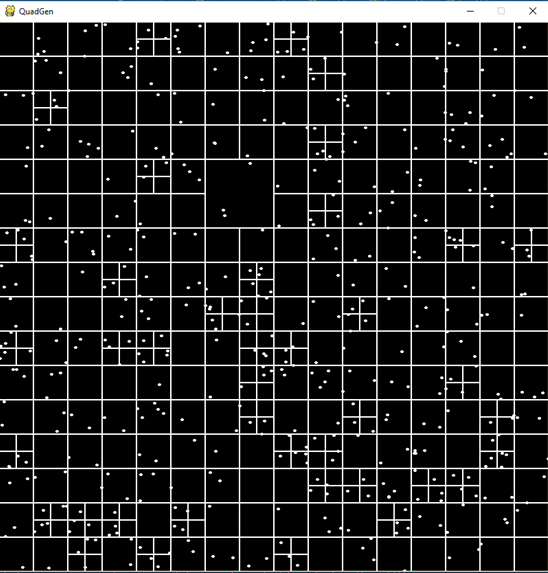
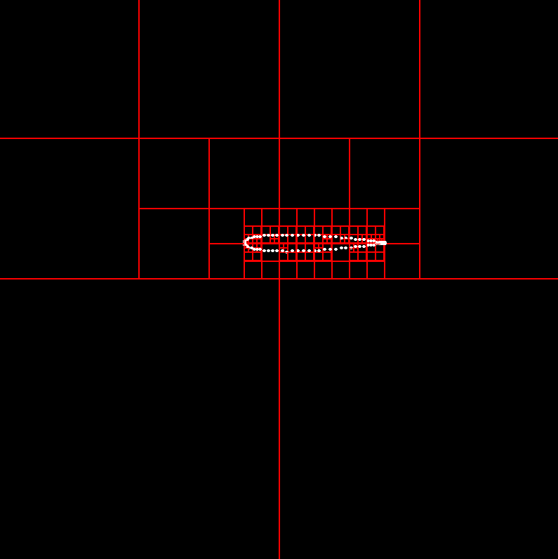

# QuadGen
A Quadtree grid generator to identify the points. The bin capacity can be changed. The default value is set to 2. The code is in the initial phase. For the sake of visualization, I used pygame module. 

But the window will close automatically because it is not run in a while loop, which is normally the case for the pygame module. The edge cases and floating point to integer conversion for some funcitons makes this application not so accurate. But the base code can be developed into something more. Credits to CodingTrain for his video.

This type of quadtree based method is used for making CFD grids from the geometry points. Students can use this get a basic understanding of how the Quadtree grid generation works.

# The QuadGen application for generating quadtrees to detect the points

# Airfoil points feeded into QuadGen

